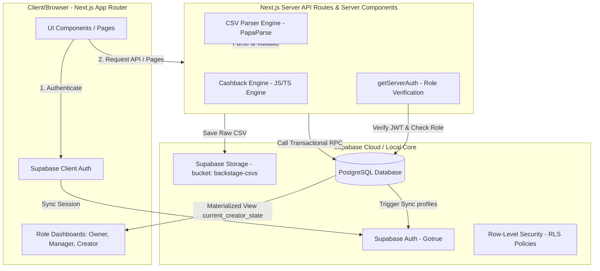
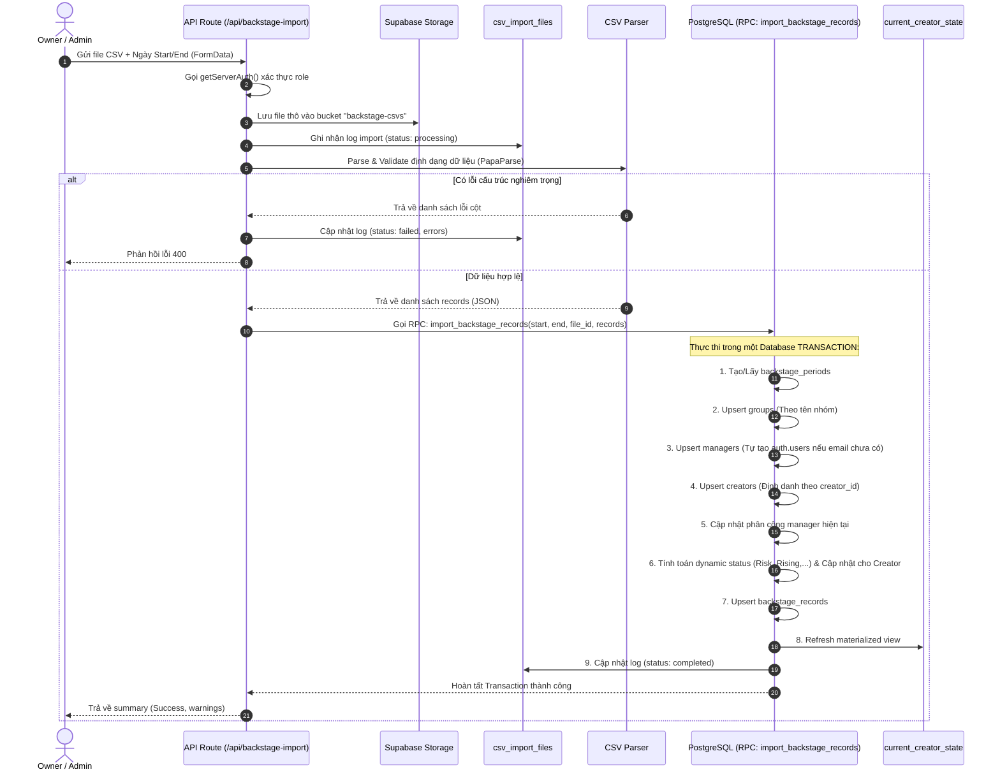

# Tài liệu Tổng Quan Kiến Trúc & Luồng Nghiệp Vụ - NewStar Operator Console (Phase 1)

Tài liệu này cung cấp một cái nhìn toàn cảnh về cấu trúc hệ thống, sơ đồ cơ sở dữ liệu, các luồng nghiệp vụ lõi (Business Flows), và cơ chế bảo mật của dự án **NewStar Operator Console**. Mục tiêu là giúp các kỹ sư (hoặc AI Agents) mới tiếp cận dự án có thể hiểu nhanh mã nguồn và phát triển tính năng mới ngay lập tức mà không cần đọc/quét toàn bộ thư mục code.

---

## 1. Kiến Trúc Dự Án (Project Architecture)

Hệ thống được xây dựng trên mô hình Full-Stack kết hợp **Next.js App Router (Frontend + API Routes)** và **Supabase (Database, Auth, Storage, Realtime)**.

### Sơ đồ Khối Hệ Thống (System Block Diagram)



---

## 2. Cấu Trúc Thư Mục Lõi (Folder Structure)

Mã nguồn được tổ chức theo chuẩn Next.js App Router và Supabase local development:

```text
/home/nhanlt/Tobi/NewStar
├── supabase/                            # Cấu hình và Cơ sở dữ liệu Supabase
│   ├── config.toml                      # Cấu hình Local Supabase CLI
│   ├── seed.sql                         # Seed dữ liệu mẫu (mock profiles, creators, periods,...)
│   └── migrations/                      # Các file SQL Migration chạy theo thứ tự
│       ├── 0001_init.sql                # Khởi tạo extension (pgcrypto, etc.)
│       ├── 0002_groups_profiles.sql     # Định nghĩa nhóm, profiles và trigger đồng bộ auth.users
│       ├── 0003_managers_creators.sql   # Phân cấp quản lý: managers, creators, assignments
│       ├── 0004_backstage.sql           # CSV imports log, records, materialized view & import RPC
│       ├── 0005_reports.sql             # Báo cáo tuần & Báo cáo hoàn tiền (cashback) hàng tháng
│       ├── 0006_collaboration.sql       # coaching notes, chats, LMS, campaigns, audit log
│       └── 0007_rls.sql                 # Toàn bộ chính sách Row-Level Security (RLS)
│
├── src/
│   ├── app/                             # Next.js App Router Pages & APIs
│   │   ├── page.tsx                     # Landing Page (Auto redirect sang login/dashboard)
│   │   ├── layout.tsx                   # Layout gốc (cấu hình fonts, styles)
│   │   ├── login/                       # Trang đăng nhập sử dụng Supabase Auth
│   │   ├── dashboard/                   # Trang quản trị chính (phân quyền hiển thị theo Role)
│   │   └── api/                         # Backend API Endpoints
│   │       ├── backstage-import/        # POST: Import CSV Backstage, upload storage và chạy RPC
│   │       ├── weekly-reports/          # POST: Tạo báo cáo tuần cho toàn bộ mạng lưới
│   │       └── cashback-reports/        # POST: Tổng hợp tiền hoàn (cashback) và đóng băng tháng
│   │
│   ├── components/                      # UI Components tái sử dụng
│   │   ├── ui/                          # Thư viện UI nguyên tử (shadcn/ui: button, card, table,...)
│   │   ├── layout/                      # Sidebar, Header cho trang dashboard
│   │   └── dashboard/                   # Giao diện Dashboards theo vai trò: Owner, Manager, Creator
│   │
│   ├── lib/                             # Thư viện tiện ích và Logic nghiệp vụ lõi
│   │   ├── auth/
│   │   │   └── server-auth.ts           # [QUAN TRỌNG] Xác thực API & Role thật từ DB
│   │   ├── cashback/
│   │   │   └── engine.ts                # [QUAN TRỌNG] Cashback Engine tính toán tiers/status
│   │   ├── csv-parser/
│   │   │   └── parser.ts                # CSV parser sử dụng PapaParse với cơ chế validation chặt chẽ
│   │   └── supabase/
│   │       ├── client.ts                # Supabase Client SDK (Dùng ở phía client-side)
│   │       ├── server.ts                # Supabase Server Client (Dùng ở server components/API)
│   │       └── admin.ts                 # Supabase Service Role Client (Dùng cho quyền super-admin)
│   │
│   └── middleware.ts                    # Next.js Middleware kiểm tra session và điều hướng trang
│
└── tests/                               # Thư mục kiểm thử tự động (Unit Tests)
    ├── cashback.test.ts                 # Kiểm tra tính toán Cashback Engine
    └── csv-parser.test.ts               # Kiểm tra tính hợp lệ của CSV Parser
```

---

## 3. Cấu Trúc Database & Thực Thể (Database Schema & Entities)

Tất cả bảng đều nằm trong schema `public` của PostgreSQL. Dưới đây là các thực thể quan trọng của Phase 1:

### 3.1. Phân Quyền & Tài Khoản (Profiles & Roles)
*   **`profiles`**: Kế thừa trực tiếp từ `auth.users` của Supabase Auth. Khi một user đăng ký/tạo trong `auth.users`, một trigger `on_auth_user_created` tự động tạo profile tương ứng.
    *   **Roles**: `owner` (Chủ mạng lưới), `admin` (Quản trị viên), `manager_lead` (Trưởng nhóm quản lý), `manager` (Quản lý creator), `creator` (Người sáng tạo nội dung).
*   **`managers`**: Mở rộng thông tin cho profile có role `manager`.
*   **`creators`**: Đại diện cho các TikTok LIVE Creators. Một creator có thể có tài khoản đăng nhập (liên kết với `profiles`) hoặc chỉ là một bản ghi dữ liệu được quản lý.
*   **`creator_manager_assignments`**: Bảng trung gian theo dõi lịch sử phân công creator cho manager nào phụ trách (có `assigned_at` và `ended_at`).

### 3.2. Dữ Liệu Import & Báo Cáo
*   **`backstage_periods`**: Lưu chu kỳ dữ liệu Backstage (ngày bắt đầu `start_date` và ngày kết thúc `end_date`).
*   **`csv_import_files`**: Nhật ký import file CSV. Lưu đường dẫn lưu trữ (`storage_path`), trạng thái import (`pending`, `processing`, `completed`, `failed`) và mảng các `errors`/`warnings`.
*   **`backstage_records`**: Chứa thông tin chi tiết hiệu suất thô của từng creator trong một chu kỳ (`period_id`), bao gồm: `diamonds` (kim cương), `live_hours` (số giờ live), `valid_days` (số ngày live hợp lệ), `followers`, `matches`.
*   **`weekly_reports` & `weekly_report_creators`**: Báo cáo tổng hợp hiệu suất hàng tuần của hệ thống và chi tiết của từng creator để chuẩn bị duyệt chi.
*   **`monthly_cashback_reports`**: Báo cáo tiền hoàn (cashback) cuối tháng đã được khóa dữ liệu (frozen snapshot) để xuất toán.

### 3.3. Materialized View `current_creator_state`
Đây là Materialized View trung tâm của toàn bộ ứng dụng, được dùng để hiển thị danh sách creator, phân tích hiệu suất và phân hạng ưu tiên. Nó lấy bản ghi mới nhất từ `backstage_records` kết hợp với thông tin manager hiện tại và nhóm (`groups`) của creator.

*   **Cập nhật dữ liệu:** Để tối ưu hóa truy vấn, view này cần được refresh sau mỗi lần import CSV thành công thông qua hàm PostgreSQL RPC:
    ```sql
    SELECT public.refresh_current_creator_state();
    ```

---

## 4. Cơ Thế Xác Thực & Phân Quyền (Auth & Security)

### 4.1. Server-Side Role Validation
Dự án áp dụng nguyên tắc **Zero-Trust Token**. Quyền hạn của người dùng (Owner, Manager, Creator, v.v.) không được tin cậy hoàn toàn từ Metadata có sẵn trong JWT Token của Supabase Auth (vì metadata này có thể bị lỗi thời nếu quyền thay đổi thời gian thực).
Khi gọi hàm `getServerAuth()` trong `src/lib/auth/server-auth.ts`:
1. Giải mã token bằng `supabase.auth.getUser()`.
2. Truy vấn trực tiếp vào bảng `public.profiles` để lấy thông tin `role` hiện tại từ DB.
3. Trả về thông tin xác thực chính xác nhất.

### 4.2. Row-Level Security (RLS)
Chính sách RLS được định nghĩa trong `0007_rls.sql` để đảm bảo an toàn dữ liệu từ tầng Database:
*   **`profiles`**: User chỉ được cập nhật profile của chính mình. `owner` và `admin` có toàn quyền xem/sửa tất cả.
*   **`creators`**: 
    *   Creator chỉ xem được bản ghi của bản thân.
    *   Manager chỉ xem được các creator được gán cho mình trong bảng `creator_manager_assignments` (kiểm tra qua điều kiện `ended_at IS NULL`).
    *   Owner/Admin xem được toàn bộ.
*   **`backstage_records`**: RLS tương tự như creators. Quyền ghi (Insert/Update/Delete) chỉ dành riêng cho `owner` và `admin` thông qua API import.

---

## 5. Các Luồng Nghiệp Vụ Lõi (Business Flows)

### 5.1. Luồng Import Dữ Liệu CSV Backstage (Backstage CSV Import Flow)

Đây là luồng phức tạp nhất của hệ thống, xử lý import lượng dữ liệu lớn và tự động chuẩn hóa thực thể.



### 5.2. Cashback Engine Rules (Công Thức Tính Hoàn Tiền)

Công thức cashback nằm trong `src/lib/cashback/engine.ts` và được đồng bộ hóa dưới dạng hàm PostgreSQL trong `0004_backstage.sql`.

#### Điều kiện đạt hạng (Tiers Table)
Để đạt một Tier, Creator phải thỏa mãn **CẢ 3 điều kiện**: Số ngày live (`valid_days`) **VÀ** Số giờ live (`live_hours`) **VÀ** Số kim cương nhận được (`diamonds`).

| Hạng (Tier) | Số Ngày Live Tối Thiểu | Số Giờ Live Tối Thiểu | Số Kim Cương (Diamonds) | Số Tiền Hoàn (USD) |
| :--- | :---: | :---: | :---: | :---: |
| **Tier 1** | 8 | 20 | 100,000 | $20 |
| **Tier 2** | 10 | 25 | 200,000 | $35 |
| **Tier 3** | 12 | 30 | 200,000 | $60 |
| **Tier 4** | 15 | 40 | 500,000 | $150 |
| **Tier 5** | 18 | 60 | 750,000 | $225 |
| **Tier 6** | 20 | 80 | 1,000,000 | $300 |
| **Tier 7** | 22 | 80 | 2,000,000 | $550 |
| **Tier 8** | 22 | 80 | 3,000,000 | $850 |

#### Các hàm logic nghiệp vụ (Core Engine Functions):
1.  **`getCashbackTier(days, hours, diamonds)`**: Lấy ra cấp độ Tier cao nhất đạt được.
2.  **`getTierGap(days, hours, diamonds)`**: Tính toán lượng chỉ số còn thiếu (days, hours, diamonds) để đạt được Tier kế tiếp.
3.  **`projectMonthEndTier(days, hours, diamonds, currentDay, totalDays)`**: Ngoại suy hiệu suất hiện tại để dự báo Tier cuối tháng đạt được dựa trên hệ số `totalDays / currentDay`.
4.  **`calculateCreatorStatus(...)`**: Trả về 1 trong 4 trạng thái phục vụ hiển thị trên Matrix Ưu Tiên (Priority Matrix):
    *   `risk` (Nguy cơ): Dự án tháng này thấp hơn tháng trước, hoặc sau 30% thời gian của tháng vẫn chưa đủ điều kiện dự án đạt Tier 1.
    *   `close` (Cận kề): Đạt từ 90% trở lên cho cả 3 chỉ số cần thiết của Tier kế tiếp.
    *   `rising` (Đang phát triển): Dự án cuối tháng vượt quá Tier hiện tại, hoặc tăng trưởng nhảy vọt (vượt ít nhất 2 cấp Tier so với tháng trước).
    *   `stable` (Ổn định): Các trường hợp bình thường khác.

### 5.3. Luồng Tạo Báo Cáo Tuần (Weekly Report Flow)
*   **Endpoint:** `/api/weekly-reports/generate` (Chỉ Owner/Admin có quyền gọi).
*   **Nhiệm vụ:**
    1.  Lấy ID chu kỳ (`periodId`).
    2.  Query tất cả các creator hoạt động trong chu kỳ từ `backstage_records`.
    3.  Tạo bản ghi trong `weekly_reports`.
    4.  Với mỗi creator, tính toán Cashback và Status tại thời điểm đó rồi insert thông tin đóng băng vào `weekly_report_creators`.
    5.  Tính tổng hợp kim cương, cashback, số creator đạt hạng rồi lưu metadata vào cột `summary` của `weekly_reports`.

### 5.4. Luồng Tạo Báo Cáo Hoàn Tiền Tháng (Monthly Cashback Report Flow)
*   **Endpoint:** `/api/cashback-reports/generate` (Chỉ Owner/Admin có quyền gọi).
*   **Nhiệm vụ:**
    1.  Nhận tham số tháng cần chốt (Ví dụ: `2026-05-01`).
    2.  Quét toàn bộ dữ liệu ghi nhận của các chu kỳ thuộc tháng đó.
    3.  Thực hiện chạy thuật toán Cashback Engine chốt số tiền hoàn cho từng creator.
    4.  Tính toán phân rã tiền hoàn theo từng Manager (`manager_breakdown`) và tỷ lệ các hạng đạt được (`tier_breakdown`).
    5.  Đóng băng danh sách chi trả chi tiết cho từng creator vào trường `creator_payouts` trong bảng `monthly_cashback_reports` để làm bằng chứng thanh toán (Audit Trail) không thể chỉnh sửa.

---

## 6. Hướng Dẫn Phát Triển Nhanh Cho AI (Quick Start Guide)

Khi bạn được yêu cầu sửa đổi hoặc nâng cấp tính năng cho hệ thống, hãy chú ý các điểm sau:

### 6.1. Cách Khởi Động Dự Án Local
*   **Next.js Server:** Chạy `npm run dev` (Khởi chạy cổng `http://localhost:3000`).
*   **Supabase local:** Đảm bảo Docker đang chạy, sau đó khởi động Supabase CLI:
    ```bash
    npx supabase start
    ```
    *   Cổng API Supabase: `http://localhost:54321`
    *   Studio Web Dashboard: `http://localhost:54323`

### 6.2. Kiểm Tra Chức Năng (Testing)
Trước khi bàn giao code, hãy luôn chạy bộ test tự động để đảm bảo logic lõi không bị phá hỏng:
```bash
npm test
```
*(Thực thi kiểm thử Unit Tests bằng Vitest cho Cashback Engine và CSV Parser).*

Bạn cũng có thể chạy tệp script E2E API flow test để kiểm tra luồng API:
```bash
node scratch/test-api-e2e.js
```

### 6.3. Sửa Đổi DB Schema
Không chỉnh sửa trực tiếp cấu trúc DB trên DB thật hay bằng giao diện Studio. Mọi thay đổi cấu trúc bảng, RLS hoặc hàm PL/pgSQL phải được viết dưới dạng tệp migration mới trong `supabase/migrations/` (ví dụ: `0008_new_feature.sql`) và chạy `npx supabase db reset` để áp dụng.

### 6.4. Cách Xử Lý Cookies Trong Next.js 14+
Thư viện `@supabase/ssr` yêu cầu xử lý cookies bất đồng bộ trên Next.js 14+ (và đặc biệt là các phiên bản mới hơn như Next.js 16). Hãy luôn `await` cookies store khi thực hiện đọc/ghi:
```typescript
import { cookies } from "next/headers";
const cookieStore = await cookies(); // Luôn luôn await cookies() trước khi sử dụng
```
